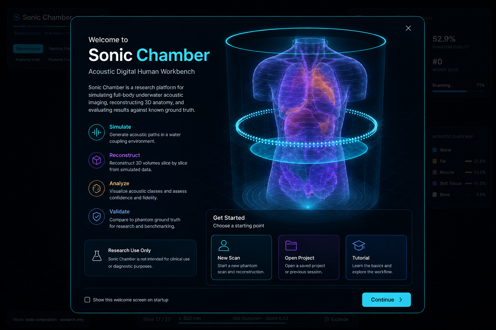

# MetaBioHacker

> Ultrasound Computed Tomography simulator + multimodal medical signal fusion harness.
> Rust physics engine · WebAssembly runtime · TypeScript SDK · zero patient data.

[](https://github.com/ruvnet/MetaBioHacker/actions/workflows/ci.yml)
[](https://ruvnet.github.io/MetaBioHacker/demo/)
[](https://ruvnet.github.io/MetaBioHacker)
[](LICENSE)

---

## Live Demo

**[→ Open interactive USCT demo](https://ruvnet.github.io/MetaBioHacker/demo/)**  
Run USCT reconstruction in-browser (WebAssembly, ~130 ms). Adjust grid resolution, ring elements, SART iterations, and phantom seed. Visualises ground truth, reconstruction, and tissue segmentation with per-cell uncertainty.

[](https://ruvnet.github.io/MetaBioHacker/demo/)

---

## What Is This?

MetaBioHacker is a **research platform** for Ultrasound Computed Tomography (USCT) — a non-ionising medical imaging modality that reconstructs the speed-of-sound and attenuation through tissue cross-sections using a ring of ultrasound transducers.

The architecture is intentionally split into three layers that never cross:

```
┌──────────────────────────────────────────────────────────────────────┐
│  FROZEN PHYSICS ENGINE  (crates/sonic-ct)                            │
│  SART · Backprojection · Landweber · FWI · Acoustic Memory · Organs  │
│  Zero external deps · Deterministic · WASM-native · 31 KB binary     │
├──────────────────────────────────────────────────────────────────────┤
│  WASM BINDING LAYER  (crates/sonic-ct-wasm)                          │
│  C ABI exports · Zero-copy buffer passing · 2-D + 3-D volume API     │
├──────────────────────────────────────────────────────────────────────┤
│  FUSION HARNESS  (packages/metabiohacker)                            │
│  Multimodal ingest · Patient state graph · Prior builder             │
│  Darwin evolution · Evidence gate · Immutable run ledger             │
└──────────────────────────────────────────────────────────────────────┘
```

**Core design principle:** the physics engine is **frozen**. Its acoustic residual is never modified by downstream context — prior fusion, contradiction penalties, or evidence grading. The harness evolves; the physics does not.

---

## Features

### 1. USCT Physics Engine (`crates/sonic-ct`)

A research-grade Ultrasound Computed Tomography simulator in pure Rust (zero external crates).

**Ring acquisition**
- Configurable transducer ring (default: 256 elements)
- Each element fires; all others record travel time + attenuation
- Procedurally generated digital human phantom: fat ring, muscle layer, soft organs, spine, cortical bone
- Deterministic: same seed → identical phantom → identical reconstruction

**Reconstruction methods** (configurable, benchmarkable)

| Method | Description | When to use |
|--------|-------------|-------------|
| `Backprojection` | 1-iteration SART; delay-and-sum | Fast baseline |
| `SART` | Simultaneous Algebraic Reconstruction Technique | Default (8 iters) |
| `Landweber` | Gradient descent on the normal equations | Large well-conditioned problems |

SART solves `A·s = t` (slowness field from travel times) via row-action updates with configurable relaxation and iteration count. Typical result: ~130 ms in WASM on a 96×96 grid.

**Five acoustic tissue classes** — no organ identity inferred from speed alone

| Class | Speed range | Attenuation |
|-------|------------|-------------|
| Water (coupling bath) | 1300–1500 m/s | 0.5 Np/m |
| Fat | 1400–1480 m/s | 8 Np/m |
| Muscle | 1500–1600 m/s | 15 Np/m |
| Organ (soft parenchyma) | 1500–1600 m/s | 12 Np/m |
| Bone (cortical) | 2400+ m/s | 120 Np/m |

Liver and spleen have overlapping speeds — they are both `Organ`. Organ identity is a separate post-hoc inference layer (see below).

**Uncertainty-first segmentation**  
Every cell carries a calibrated uncertainty score: `uncertainty = exp(−margin / scale)` where `margin` is the distance (m/s) from the reconstructed speed to the nearest class boundary. Cells deep inside a class score near 0; cells on boundaries score near 1. Fully explainable — no black-box network.

**Quality metrics**  
Dice@1/5 classes, MAE, RMSE, PSNR, SSIM — all computed against the synthetic ground truth included in every phantom.

---

### 2. 3-D Volume Sweep

Progressive axial reconstruction slice-by-slice. Each call to `sct_vol_step()` reconstructs one slice and returns the running count. After all `nz` slices complete, the engine runs organ inference.

**Volume outputs**
- Per-slice Dice and MAE arrays
- Aggregated body composition fractions (water / fat / muscle / organ / bone as % of volume)
- Running confidence score updated after each slice
- Quality flags per slice: `bone_shadow`, `sparse_coverage`, `boundary_uncertainty`, `gas_artifact`

---

### 3. Organ Inference

After a full volume sweep, the engine hypothesizes anatomical structures from shape, size, and position — never from speed alone (ADR-0009).

Each hypothesis carries:
- **Organ ID** — semantic label (liver, spleen, kidney, etc.)
- **Confidence** — 0–1 score against known anatomical templates
- **Evidence bitmask** — which observations support the hypothesis (e.g., "left of midline + below diaphragm + parenchymal speed")

---

### 4. Acoustic Memory (NSW Index)

An internal navigable small-world (NSW) graph that stores L2-normalised speed-map embeddings. Enables:

- **Longitudinal tracking** — nearest-neighbour lookup across patient scans over time
- **FWI warm-starting** — initialise Full-Waveform Inversion from the closest past reconstruction rather than a flat water prior
- **Anomaly detection** — flag anatomically impossible configurations (e.g., bone cells adjacent to water cells with no transition tissue)
- **Coherence check** — raises quality flags for: `bone_touches_water`, `organ_touches_water`

NSW insert throughput: ~150K embeddings/second. Archive format: `.rvf` (portable binary, round-trips losslessly).

---

### 5. Full-Waveform Inversion (FWI)

Solves the 2-D scalar acoustic wave equation to recover sub-mm resolution:

```
∂²p/∂t² = c²(x,y) ∇²p + f(x,t)
```

Implemented features:
- Explicit finite-difference forward solver (Ricker wavelet source, CFL-stable step, sponge boundary)
- Adjoint-state gradient: `∂χ/∂κ = Σ_t λ(x,t) · ∇²p(x,t)` — no finite-difference approximation
- Gradient descent with source/receiver footprint muting and backtracking step
- **Frequency continuation (multiscale):** low-frequency stages first (cycle-skip-robust), refine at higher frequencies
- Gradient check in CI: cosine(adjoint, finite-diff) > 0.85
- Misfit reduction test: ≥15% drop over iterations

FWI is the roadmap path to sub-mm bone resolution — SART's straight-ray physics yields Dice ≈ 0 for bone (ADR-0026). FWI is implemented and tested, but not the default reconstruction method.

---

### 6. CLI Binaries

| Binary | Command | Purpose |
|--------|---------|---------|
| `sonic_ct_demo` | `cargo run --release --bin sonic_ct_demo /tmp/out` | One-shot reconstruction → PGM images + metrics |
| `sonic_ct_train` | `cargo run --release --bin sonic_ct_train 24 /tmp/out` | Train segmentation model; build acoustic memory |
| `sonic_ct_serve` | `echo '{"n":96,"policy":{}}' \| ./sonic_ct_serve` | Frozen-engine JSON stdio (for harness evolution) |
| `sonic_ct_methods` | `cargo run --release --bin sonic_ct_methods` | Benchmark BP vs SART vs Landweber (RMSE, PSNR, SSIM) |

`sonic_ct_serve` is the key integration point: the harness writes a JSON policy object, the engine runs and returns scores — no shared state, fully composable.

---

### 7. WebAssembly Binding Layer (`crates/sonic-ct-wasm`)

C ABI bindings with zero-copy buffer access — no wasm-bindgen, no JavaScript glue, 31 KB binary.

**2-D API (single slice)**
```javascript
wasm.sct_run(96, 256, 270, 8, 42)  // n, elements, fan°, iters, seed → 1 (ok)
wasm.sct_mae()                      // mean absolute speed error (m/s)
wasm.sct_mean_dice()                // mean Dice across 5 classes
wasm.sct_dice(4)                    // per-class Dice (0=water..4=bone)
wasm.sct_anomaly()                  // 1 if anatomical anomaly detected

// Zero-copy buffer access
const ptr = wasm.sct_recon_speed_ptr() / 4;
const speed = new Float32Array(wasm.memory.buffer, ptr, 96 * 96);
```

**3-D API (progressive volume)**
```javascript
wasm.sct_vol_begin(48, 96, 256, 270, 8, 42)  // nz slices
while (wasm.sct_vol_step() < 48) {
  renderSlice();  // non-blocking, one slice per frame
}
// after sweep completes:
wasm.sct_vol_fraction(1)   // fat fraction
wasm.sct_organ_count()     // hypothesized organs
wasm.sct_organ_conf(0)     // confidence of first hypothesis
wasm.sct_quality_flag(0)   // bone shadow severity (0=none..2=high)
```

Full reference: [docs/api/sonic-ct-wasm.md](docs/api/sonic-ct-wasm.md)

---

### 8. React Three Fiber Browser Demo (`examples/sonic-ct`)

Live in-browser USCT visualisation at `http://localhost:5184`:

- Ground truth speed map vs. reconstructed speed map side-by-side
- Tissue segmentation overlay with per-cell uncertainty colouring
- Transducer ring animation during acquisition
- Sliders: grid resolution · ring elements · SART iterations · phantom seed
- 3-D body sweep: progressive vertical scan with body composition display
- Organ hypothesis panel: detected organs + confidence + evidence flags
- Quality flag indicators: bone shadow / sparse coverage / boundary uncertainty / gas

---

### 9. Multimodal Fusion Harness (`packages/metabiohacker`)

TypeScript layer that ingests typed medical observations and builds reconstruction priors without ever forcing a diagnosis.

**Supported modalities**
`acoustic · mri · ct · ultrasound · ekg · eeg · lab · pathology · cytology · pap · hpv · biopsy · wearable`

**Supported source formats**
`CSV · JSON · DICOM · FHIR · PDF · RAW`

**Medical standards alignment** (ADR-0016)

| Standard | Role |
|----------|------|
| DICOM | Imaging containers, pixel data, study/series |
| HL7 FHIR | Clinical data exchange |
| LOINC | Lab observation codes |
| SNOMED CT | Clinical findings |
| OMOP CDM | Research analytics |

---

### 10. Prior Builder

Observations modify reconstruction prior weights — they never force a diagnosis:

```typescript
const prior = buildReconstructionPrior(observations);
// MRI  → anatomyPriorWeight += 0.9, organBoundaryPriorWeight += 0.7
// CT   → anatomyPriorWeight += 0.75
// EKG  → cardiacTimingWeight += 0.85
// EEG  → neuralTimingWeight += 0.8
// Path → pathologyValidationWeight += 0.95 + humanReviewRequired = true
// All weights clamped to [0, 1]
```

Multimodal context lifts `reconstructionStability` by ~10–12%. The `acousticResidual` is passed through **unchanged** — it is the immutable physics truth.

---

### 11. Patient State Graph

Typed observation graph with temporal ordering and contradiction detection:

```
Nodes: patient · observation · body_site · specimen · procedure · device · finding · time_window
Edges: has_observation · measures_site · from_specimen · supports · conflicts_with
       temporally_near · requires_review · derived_from
```

**Contradiction detection** flags inconsistencies (e.g., tachycardia in EKG + sleep state in EEG) and applies a confidence penalty — but never modifies `acousticResidual`.

---

### 12. Evidence Gate

Claims are gated by an evidence grading layer (`ruvn`) that runs off the hot path:

| Grade | Description | Gate result |
|-------|-------------|-------------|
| A | Primary research evidence | Allowed (with citations) |
| B | Reputable secondary evidence | Allowed (with citations) |
| C | Contextual only | **Blocked** |
| D | No evidence | **Blocked** |

Pathology observations always force human review regardless of evidence grade.

---

### 13. Darwin Harness Evolution

Multi-objective parameter search using `@metaharness/darwin` Pareto-front selection:

- **Genome:** reconstruction policy parameters (SART iterations, relaxation, prior weights, routing thresholds)
- **Fitness:** `stability ≥ +10%` OR `latency ≥ −20%`, no regression in `acousticResidual`
- **Write layer (optional):** OpenRouter-backed LLM for harness mutations (env-key, capped budget)
- **Interface:** `sonic_ct_serve` JSON stdio — the frozen engine serves as the objective function

The engine never changes. Only the harness parameters evolve.

---

### 14. Immutable Run Ledger

Every pipeline execution produces a `ReconstructionLedger` with a SHA-256 chain hash of:

```
observationHash → priorHash → graphHash → scoreHash → ledgerHash
```

Each published result is independently verifiable by re-running with the same observation set and comparing `ledgerHash`. The ledger also records:
- `acousticEngine.frozen = true` + binary hash
- All routing decisions (local / cheap / mid / frontier / human_review)
- Safety flags: `diagnosticLanguageBlocked`, `uncertaintyOverlayRequired`, `humanReviewRequired`
- `allowedOutputMode`: research / wellness / clinicalReview

---

## Quick Start

### Native (Rust CLI)

```bash
git clone https://github.com/ruvnet/MetaBioHacker
cd MetaBioHacker

# Run reconstruction → PGM images + metrics
cargo run --release --bin sonic_ct_demo /tmp/out

# Train segmentation model + build acoustic memory
cargo run --release --bin sonic_ct_train 24 /tmp/out

# Benchmark reconstruction methods
cargo run --release --bin sonic_ct_methods

# Run frozen engine over JSON stdio (for harness integration)
echo '{"n":96,"elements":256,"iters":8,"seed":42}' | cargo run --release --bin sonic_ct_serve
```

### WebAssembly (browser demo)

```bash
bash scripts/build-sonic-ct-wasm.sh
cd examples/sonic-ct && npm install && npm run dev
# → http://localhost:5184
```

### TypeScript harness

```typescript
import {
  buildReconstructionPrior,
  scoreMultimodalRun,
  createRunLedger,
} from 'metabiohacker';
import type { MedicalObservation } from 'metabiohacker';

const observations: MedicalObservation[] = [
  { modality: 'mri',  uncertainty: 0.1,  consentScope: 'research', /* ... */ },
  { modality: 'lab',  uncertainty: 0.05, consentScope: 'research', /* ... */ },
];

const prior = buildReconstructionPrior(observations);
// prior.humanReviewRequired → false (no pathology)

const score = scoreMultimodalRun({ acoustic: engineResult, prior });
// score.acousticResidual → FROZEN (engine output, never modified)
// score.reconstructionStability → engine + ~10-12% from prior fusion

const ledger = createRunLedger('patient-001', observations, prior, graph, [], score, gateResult);
// ledger.hashes.ledgerHash → stable, verifiable
```

---

## CI Guards

```
push / PR → main
│
├── Rust physics engine
│   ├── cargo fmt --check          (formatting)
│   ├── cargo clippy (deny warns)  (code quality)
│   └── cargo test --release       (16 physics tests)
│
└── MetaBioHacker governance gates
    └── npm test                   (14 governance tests)
```

### The four non-negotiable invariants

| Gate | What it enforces |
|------|-----------------|
| **Acoustic residual is immutable** | `score.acousticResidual === engine.acousticResidual` — downstream context never alters physics output |
| **Pathology → human review** | `modality ∈ {pathology, biopsy, pap, hpv, cytology}` always sets `humanReviewRequired = true` |
| **Evidence grading** | Grade C/D or no-citation claims are blocked by `gateEvidence()` |
| **Honesty gate** | Results below Dice 0.4 are not surfaced as headline numbers |

---

## Architecture Decisions

| ADR | Decision |
|-----|---------|
| [ADR-0001](docs/adr/ADR-0001-rust-zero-dep-core.md) | Zero-dependency Rust engine (WASM-safe, auditable) |
| [ADR-0002](docs/adr/ADR-0002-wasm-c-abi.md) | C ABI WASM bindings — no wasm-bindgen, 31 KB |
| [ADR-0003](docs/adr/ADR-0003-frozen-engine.md) | Frozen physics, evolved harness |
| [ADR-0004](docs/adr/ADR-0004-sart-baseline.md) | SART as reconstruction baseline (1 iter = backprojection) |
| [ADR-0007](docs/adr/ADR-0007-uncertainty-first.md) | Uncertainty-first segmentation (explainable, no network) |
| [ADR-0009](docs/adr/ADR-0009-five-tissue-classes.md) | Five acoustic classes only — no organ labels from speed |
| [ADR-0014](docs/adr/ADR-0014-darwin-harness.md) | Darwin multi-objective harness evolution |
| [ADR-0016](docs/adr/ADR-0016-medical-standards.md) | DICOM/FHIR/LOINC/SNOMED alignment |
| [ADR-0018](docs/adr/ADR-0018-samd-boundary.md) | SaMD regulatory boundary |
| [ADR-0019](docs/adr/ADR-0019-medical-signal-os.md) | Medical Signal OS: frozen core + evolved policy |
| [ADR-0026](docs/adr/ADR-0026-fwi-roadmap.md) | FWI roadmap for sub-mm bone resolution |

---

## Scope & Governance

Three operating modes — none constitute autonomous diagnosis:

| Mode | What it enables |
|------|----------------|
| `research` | Dataset construction, physics benchmarking, model evaluation |
| `wellness` | Non-diagnostic self-baseline monitoring |
| `clinicalReview` | Decision support reviewed by a licensed professional |

Any use influencing diagnosis, treatment, triage, or clinical management requires a regulatory pathway (FDA GMLP / PCCP, PHIPA). See [docs/GOVERNANCE.md](docs/GOVERNANCE.md).

**No real patient data is included in this repository.**

---

## Known Limitations

| Limitation | Root cause | Roadmap |
|-----------|-----------|---------|
| Bone Dice ≈ 0 | Straight-ray physics ignores acoustic shadow | FWI (ADR-0026) |
| Soft organ Dice ≈ 0.3–0.4 | Liver/spleen speed overlap | Multi-frequency FWI |
| Synthetic phantom only | No real-data ingest pipeline | DICOM/FHIR adapters (ADR-0016) |
| 2-D physics (default) | Slice-by-slice, not true 3-D wave equation | 3-D FWI (future) |

---

## Performance

| Metric | Value | Condition |
|--------|-------|-----------|
| Reconstruction time | ~130 ms | WASM, 96×96, 256 elements, 8 SART iters |
| WASM binary | 31 KB | C ABI, no wasm-bindgen |
| Fat Dice | ~0.72 | Tuned SegModel, synthetic phantom |
| Muscle Dice | ~0.65 | Tuned SegModel |
| Mean Dice (5 classes) | ~0.63 | Tuned vs. 0.30 default |
| Acoustic memory insert | ~150K/s | NSW index |
| Multimodal stability lift | +10–12% | Prior fusion (MRI + EKG + labs) |

---

## Contributing

1. Fork and open a PR against `main`
2. All four CI governance gates must pass
3. New reconstruction changes require a Dice or MAE regression test
4. New harness changes require a governance test in `packages/metabiohacker/test/`
5. Significant architectural decisions → new ADR in `docs/adr/`

---

## License

MIT — see [LICENSE](LICENSE).

---

*Born from [ruvnet/ruvector](https://github.com/ruvnet/ruvector) PR #595 · June 2026*
